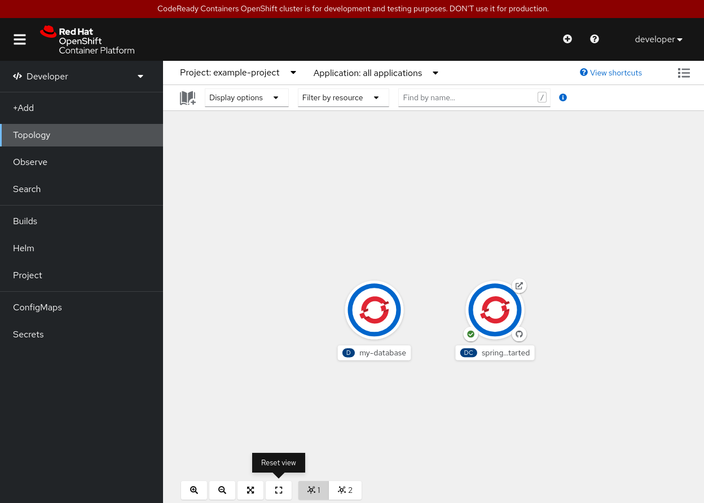
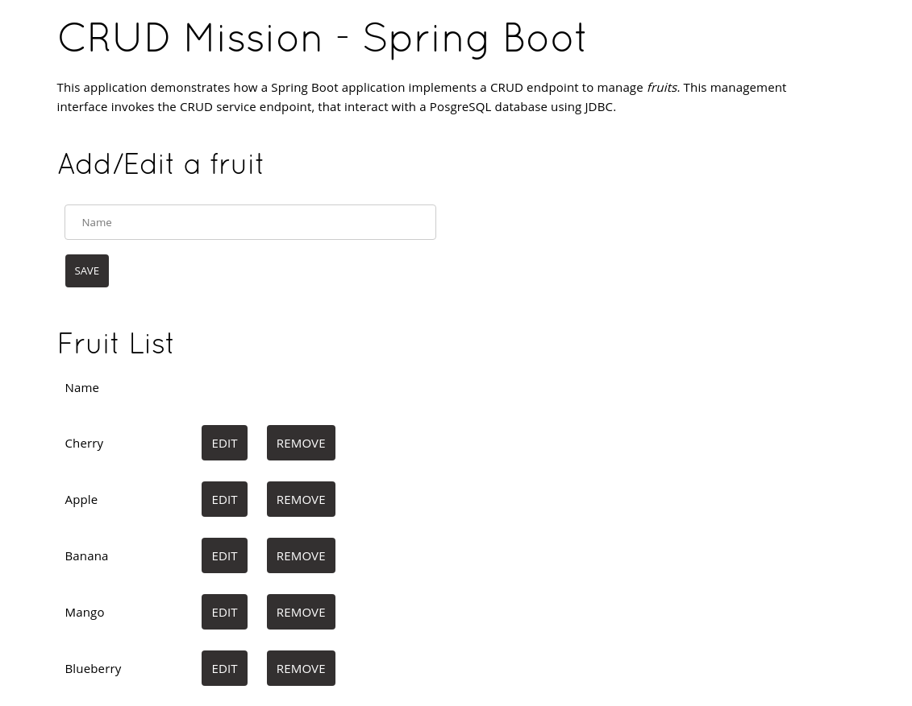

# spring-rhoar-example
Red Hat OpenShift Application Runtimes example Spring application

Example Taken from https://github.com/openshift-katacoda/rhoar-getting-started

This is done and tested using CodeReady Containers.

## Local development

Run the application:

```
mvn spring-boot:run
```

View at http://localhost:8080

## OpenShift

Create new project:

```
oc new-project example-project --display-name="Dev - Spring Boot App"
```

Create a database:

```
oc new-app -e POSTGRESQL_USER=luke -e POSTGRESQL_PASSWORD=secret -e POSTGRESQL_DATABASE=my_data openshift/postgresql:12-el8 --name=my-database
```

See the following files for configuration details:

```
src/main/jkube/deployment.yml
src/main/resources/application-openshift.properties
```


Use Maven to deploy the application to OpenShift, repeat this to redeploy code changes:

```
mvn package oc:deploy -Popenshift -DskipTests
```

## Routes

```
oc get routes
```

Examples:

http://spring-getting-started-example-project.apps-crc.testing
http://spring-getting-started-example-project.apps-crc.testing/actuator/health
http://spring-getting-started-example-project.apps-crc.testing/actuator/metrics
http://spring-getting-started-example-project.apps-crc.testing/actuator/metrics/jvm.memory.max


## Screenshots


